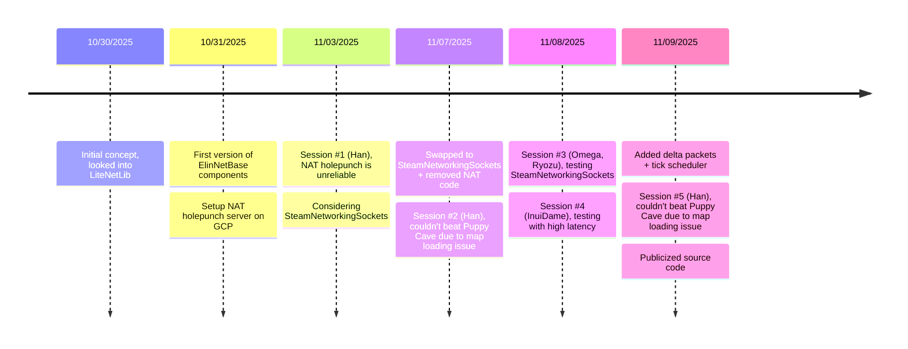
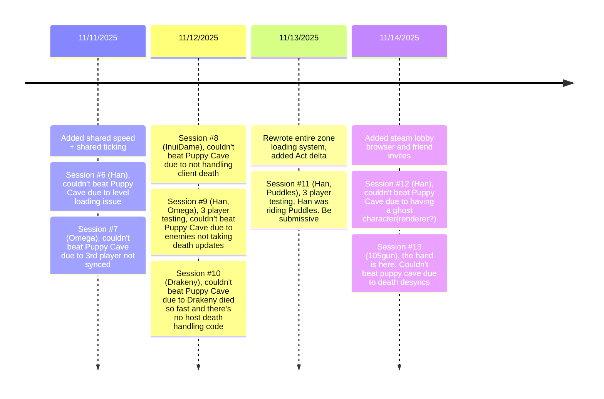

# Eternal League of Networking (EMP)

A WIP attempt of bringing networking feature to Elin.

## Play
To play with friends, it's recommended to use a minimal modlist and keep them consistent for all players. Use steam workshop collections for that purpose.

Host needs to start the game, load into a save or make a new game, and open up the panel from Esc-Mods-Elin Together.

From there, host can invite friends directly from panel or right click in steam friend list and Invite to Game.

The player characters are randomly generated right now(for testing purpose)
.

## Timeline

### Prototyping


### Puppy Caving


## Build
This project requires environment variable `ElinGamePath` set to the root folder of the Elin game installation.
```
ElinGamePath/
├─ BepInEx/
│  ├─ core/
│  │  ├─ *.dll
├─ Elin_Data/
│  ├─ Managed/
│  │  ├─ *.dll
```

This project references Custom Whatever Loader, you can get it from Steam Workshop or GitHub tagged releases, either build is fine (as of 1.20.55).

To build EMP, you need to install [.NET SDK 10.0.x](https://dotnet.microsoft.com/en-us/download/dotnet/10.0)

Clone the project:
```ps
git clone https://github.com/gottyduke/Elin.Plugins.git
cd Elin.Plugins
```

Install the deps:
```ps
dotnet restore ./ElinTogether/ElinTogether --locked-mode
```

Build the project:
```ps
dotnet build ./ElinTogether/ElinTogether -c Debug -o ./out --no-restore
```

---
<p align="center">MIT License, 2024-present DK</p>
