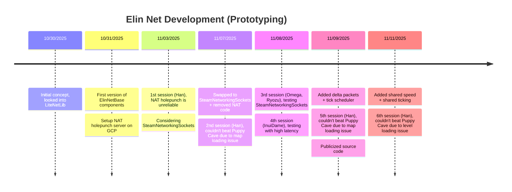

# Eternal League of Networking (EMP)

A WIP attempt of bringing networking feature to Elin.

## Timeline



## Build
This project requires environment variable `ElinGamePath` set to the root folder of the Elin game installation.
```
ElinGamePath/
├─ BepInEx/
│  ├─ core/
│  │  ├─ *.dll
├─ Elin_Data/
│  ├─ Managed/
│  │  ├─ *.dll
```

This project references Custom Whatever Loader, you can get it from Steam Workshop or GitHub tagged releases, either build is fine (as of 1.20.55).

To build EMP, you need to install [.NET SDK 10.0.x](https://dotnet.microsoft.com/en-us/download/dotnet/10.0)

Clone the project:
```ps
git clone https://github.com/gottyduke/Elin.Plugins.git
cd Elin.Plugins
```

Install the deps:
```ps
dotnet restore ./ElinTogether/ElinTogether --locked-mode
```

Build the project:
```ps
dotnet build ./ElinTogether/ElinTogether -c Debug -o ./out --no-restore
```

---
<p align="center">MIT License, 2024-present DK</p>