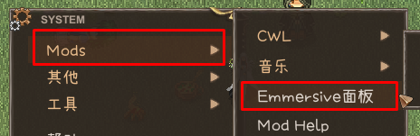

# Elin with AI

[English](./README.md)

使用 AI 大语言模型增强 Elin，让世界充满生机，生成具有环境感知的对话。

## 依赖 YKFramework

* [YKFramework](https://steamcommunity.com/sharedfiles/filedetails/?id=3400020753)

将这俩模组置于 Elin with AI 上方。

## 功能与饼

这是一个 **测试版**，用于收集反馈。

* [x] 支持 Google Gemini、OpenAI、DeepSeek、其他 OpenAI 兼容服务、Player2、Ollama 等本地模型
    * [x] 自定义模型参数、游戏内测试连接、多个服务按优先级依次使用
* [x] 上下文：附近角色、角色背景与关系（Puddles 写了一大堆）、区域、环境、附近物品、最近动作
    * [x] NPC 的原版台词会触发 AI 对话
* [x] NPC 记忆：短期、长期与总结（默认关闭，见 [NPC 记忆](#npc-记忆)）
* [x] 玩家聊天
* [x] 自定义提示词，支持 UI 编辑与内置本地化
* [x] 信仰上下文（暂时停用）
* [ ] 任务上下文与随机任务生成
* [ ] 玩家回应选项

## 如何添加 AI 服务

载入存档，按 Esc → Mods → Elin with AI，在「AI 服务」标签页中添加服务。

* **DeepSeek** 已预设 `https://api.deepseek.com/v1`，粘贴 API 密钥即可。
* 其他 OpenAI 兼容服务（如中转站）需要在服务卡片上填好「接口地址」和「模型」，再点「保存并刷新」。
* **Player2** 需要在本机运行 Player2 App。
* **Ollama** 需要在本机运行 Ollama，添加时要填写已下载的模型名称（例如 `qwen3:8b`，可用 `ollama list` 查看）。
* 在卡片上点「测试连接」，确认服务可用。

模型必须能以 JSON 回复（结构化输出或 JSON 模式）。API 密钥在本机加密存储。

服务按列表从上到下使用，可用 ↑↓ 调整顺序。请求遇到服务器错误或频率限制时，会换下一个服务重试（配置项 `Retries`）；超时，以及密钥、模型写错这类错误（HTTP 400/401/403/404）不会重试。失败的服务会暂停 `ServiceCooldown` 秒后再使用。

[主流 API 服务设置指南](https://elin-modding.net/zh/articles/100_Mod%20Documentation/Emmersive/API_Setup)

## 游戏内

1. 附近 NPC（默认 4 格内）说出原版台词时，台词照常显示，AI 会接着写出周围角色的反应。刚说过话的角色会进入冷却（`TurnsCooldown`、`SecondsCooldown`），期间原版台词会被禁用。
2. 距上一轮 AI 对话约 12 回合后（`TurnsIdleTrigger`），只要附近有人，就会自动开始新的一轮。
3. 游戏自带的 **聊天** 键会打开聊天框，输入即可与附近 NPC 交谈。输入 `@1 文本` 可让第 1 位队友说出这句话。
4. 「AI 服务」页的「AI 对话」开关可随时开启或关闭 AI，开关状态会保存下来。也可以在配置中设置 `ToggleKey` 快捷键（「Mod 配置」按钮）。
5. 没有可用的服务时，NPC 启用原版台词。

## NPC 记忆

记忆默认关闭。在「记忆」页打开「角色记忆」开关（或配置中的 `[Memory] Enabled`）后，重要角色会记住最近的对话。只有在「角色背景」页勾选了「自动总结长期记忆」的角色，才会自动总结长期记忆。在「记忆」页还可以查看、编辑角色的记忆，或手动总结。

## 自定义提示词

使用面板中的「编辑」和「打开文件夹」按钮。更新模组不会覆盖这个文件夹，修改后会自动重新加载。

* `Emmersive/SystemPrompt.txt`：必须保留 `{{max_reactions}}` 与 `{{language_code}}` 占位符以及 JSON 数组输出格式。
* `Emmersive/Characters/<角色id>.txt`：角色背景，玩家为 `player.txt`。
* `Emmersive/Relations/<id1>+<id2>.txt`：文件名就是键，整个文件都是提示词。玩家的 id 是 `player`。
* `Emmersive/Zones/Zone_<zoneId>@<层>.txt`：区域背景。

其他模组作者也可以在自己的模组中放入同样的 `LangMod/<语言>/Emmersive/...` 文件，为自己的 NPC 提供背景。

## 反馈

如有建议或 Bug 报告，请在 Elona Discord 找 @freshcloth，并附上 `Player.log`，路径为 `%USERPROFILE%\AppData\LocalLow\Lafrontier\Elin\Player.log`。

或者加入 Elin模组讨论群 872068953 。