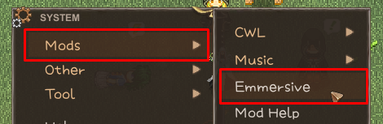

# Elin with AI

[中文](./README.CN.md)

Power up Elin with AI and LLMs, make the world alive by generating contextual aware conversations.

## Requires Custom Whatever Loader & YKFramework

+ [Custom Whatever Loader](https://steamcommunity.com/sharedfiles/filedetails/?id=3370512305) (Pick Stable **OR** Nightly)
+ [YKFramework](https://steamcommunity.com/sharedfiles/filedetails/?id=3400020753)

## Features & Todos:

This is a **beta test** version, mainly for gathering reports and feedback.

+ [x] Support Google AI Studio (gemini)
+ [x] Support OpenAI chatGPT
+ [x] Support OpenAI-compatible providers (DeepSeek, Qwen, etc)
+ [x] Support Local LLM (webui, ollama, etc)
  + [x] Custom model parameters 
+ [x] Test services at runtime
  + [x] With easy to use UI
  + [x] Service pooling
+ [x] Character context
  + [x] Nearby characters
  + [x] Character backgrounds (Puddles provided a bunch of them)
  + [x] Character relationships (Puddles provided a bunch of them)
  + [x] Character original talk as triggers
+ [x] Recent action context
  + [x] Toggle between talk-only and full action
+ [x] Zone context
  + [x] Zone backgrounds
+ [x] Environment context
+ [x] Item/Equipment context
  + [x] Nearby things
+ [x] Religion context
+ [ ] Quest context
  + [ ] Random quest generation
+ [ ] Response choices from player
+ [x] Customize context prompts
  + [x] With easy to use UI
  + [x] Builtin localization support (by CWL)

## How to Add Services

Emmersive(Elin with AI) requires the AI service with **function-calling**(or **tool-call**) and **structured output**(or **json mode**) capabilities.

Your API keys will be encrypted locally your computer, not sent anywhere.

By adding multiple AI services, Emmersive(Elin with AI) will enable auto-retry on request failure seamlessly.

Start with loading up game, press Esc and go to Mods->Emmersive to view the config panel.

[Detailed API setup page for popular providers]([./API_Setup.md](https://elin-modding-resources.github.io/Elin.Docs/articles/100_Mod%20Documentation/Emmersive/API_Setup))

## Feedback

For any suggestions, feedbacks, bug reports, or feature requests, ping Omega at Elona discord.
