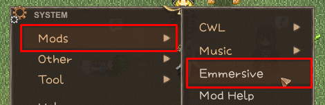

# Elin with AI

[中文](./README.CN.md)

Power up Elin with AI and LLMs, make the world alive by generating contextual aware conversations.

## Requires YKFramework

+ [YKFramework](https://steamcommunity.com/sharedfiles/filedetails/?id=3400020753)

## Features & todos

This is a **beta test** version for gathering feedback.

+ [x] Google Gemini, OpenAI, DeepSeek, other OpenAI-compatible APIs, Player2, Ollama and other local LLMs
  + [x] Custom model parameters, in-game connection tests, several services used in priority order
+ [x] Context: nearby characters, backgrounds and relationships (Puddles wrote a bunch), zone, environment, nearby items, recent actions
  + [x] Vanilla NPC lines start AI conversations
+ [x] NPC memory: short-term, long-term and summarization (off by default, see [NPC Memory](#npc-memory))
+ [x] Chat from player
+ [x] Custom prompts, with UI and built-in localization
+ [x] Religion context (temporarily disabled)
+ [ ] Quest context and random quest generation
+ [ ] Response choices from player

## How to add services

Load a save, press Esc and go to **Mods → Elin with AI**, then add a service in the **AI Service** tab.

+ **DeepSeek** is preset with `https://api.deepseek.com/v1`, so you only need to paste your API key.
+ For other OpenAI-compatible APIs, fill in **Endpoint** and **Model** on the service card, then click **Save & Refresh**.
+ **Player2** needs the Player2 App running on this PC.
+ **Ollama** needs Ollama running on this PC, and asks for the name of a model you have pulled (e.g. `qwen3:8b`, see `ollama list`).
+ Click **Test Connection** on the card to check that it works.

The model must reply in JSON (structured output or JSON mode). API keys are stored encrypted on your PC.

Services are used from top to bottom, and you can reorder them with ↑↓. When a request fails with a server error or a rate limit, the next service is tried (`Retries` in the config). Timeouts and errors such as a wrong key or model (HTTP 400/401/403/404) are not retried. A service that failed rests for `ServiceCooldown` seconds before it is used again.

[Setup guide for popular providers](https://elin-modding.net/articles/100_Mod%20Documentation/Emmersive/API_Setup)

## In-Game

1. When a nearby NPC (within 4 tiles by default) says a vanilla line, the line is shown as usual and the AI writes how the people around react. A character that just spoke waits a while before speaking again (`TurnsCooldown`, `SecondsCooldown`), and its vanilla lines during that time are skipped.
2. About 12 turns after the last AI conversation (`TurnsIdleTrigger`), a new one starts on its own if anyone is around.
3. The game's **Chat** key opens the chat box to talk to nearby NPCs. Type `@1 text` to have your first party member say it.
4. The **AI Talk** switch in the **AI Service** tab turns the AI on or off, and the setting is saved. You can also bind `ToggleKey` in the config (**Mod Config** button).
5. When no service is usable, NPCs just say their vanilla lines.

## NPC memory

Memory is off by default. Turn on **Character Memory** in the **Memory** tab (or `[Memory] Enabled` in the config) and important characters remember recent talks. Long-term memory is only summarized automatically for characters with **Auto-summarize long-term memory** checked on their card in the **Backgrounds** tab. The **Memory** tab also lets you view, edit and summarize a character's memory by hand.

## Custom prompts

Use the panel's **Edit** and **Open Folder** buttons. Mod updates never touch this folder, and edits reload automatically.

+ `Emmersive/SystemPrompt.txt`: keep the `{{max_reactions}}` and `{{language_code}}` placeholders and the JSON array output format.
+ `Emmersive/Characters/<chara id>.txt`: a character's background. Use `player.txt` for your own character.
+ `Emmersive/Relations/<id1>+<id2>.txt`: the file name is the key, and the whole file is the prompt. The player's id is `player`.
+ `Emmersive/Zones/Zone_<zoneId>@<level>.txt`: a zone background.

Mod authors can ship the same files under `LangMod/<language>/Emmersive/...` to give their NPCs a background.

## Feedback

For suggestions or bug reports, ping @freshcloth on the Elona Discord with your `Player.log` from `%USERPROFILE%\AppData\LocalLow\Lafrontier\Elin\Player.log`.