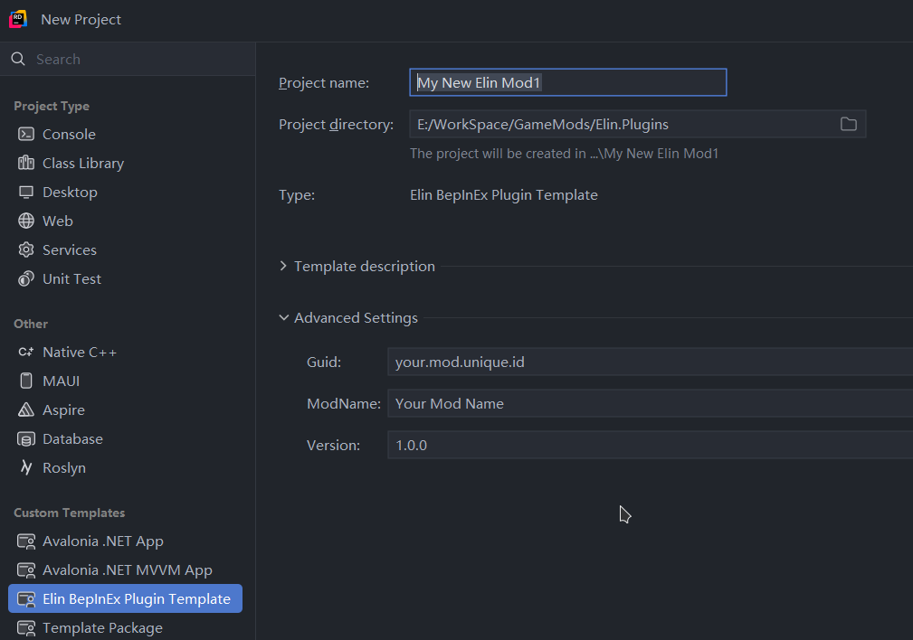

# Elin.PluginTemplate

## Consumption


Install from NuGet, using NPM or dotnet CLI:
```ps
dotnet new install ElinPluginTemplate
```

## Build

The environment variable `ElinGamePath` must be set to the root path of the Elin installation. 
```
ElinGamePath/
├─ BepInEx/
│  ├─ core/
│  │  ├─ *.dll
├─ Elin_Data/
│  ├─ Managed/
│  │  ├─ *.dll
```

## Create Project

Use JetBrains Rider or Visual Studio to create a new project from template. Fill in the necessary template information in the advanced settings.


Or if you really want to use VSC:
```
dotnet new elinplugin -n MyNewMod --Guid "unique.mod.id" --ModName "My New Awesome Mod"
```

Anything put inside `package/` folder will be copied to the output folder, which is `ElinGamePath/Package/Mod_{ModName}/`.

Things you can put in `package/` folder:
+ `package.xml`
+ `preview.jpg`
+ `Texture` folder
+ `Sound` folder
+ etc.
