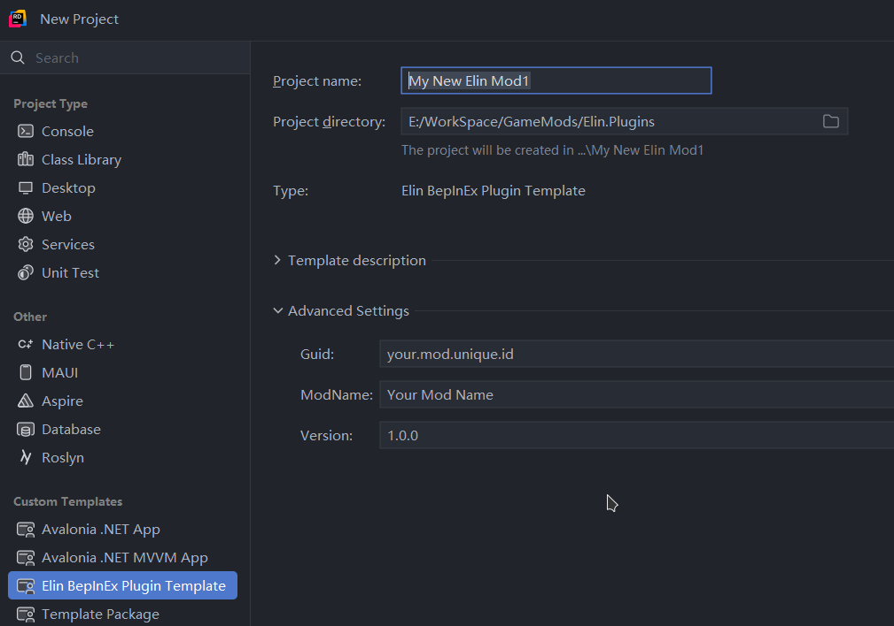

# Elin.PluginTemplate

[English](README.md) | 中文 | [日本語](README.ja.md)


[](https://dotnet.microsoft.com/en-us/download/dotnet/10.0)

用于快速搭建 [Elin](https://store.steampowered.com/app/2135150/Elin/) 模组项目的 `dotnet new` 模板，基于 [BepInEx](https://github.com/BepInEx/BepInEx) + [Harmony](https://github.com/pardeike/Harmony)。

---

## 环境要求

- [.NET SDK 10.0](https://dotnet.microsoft.com/en-us/download/dotnet/10.0)（或更高版本）
- 已安装 Elin 游戏（Steam）

---

## 安装模板

```pwsh
dotnet new install ElinPluginTemplate
```

更新已安装的版本：

```pwsh
dotnet new install ElinPluginTemplate --force
```

---

## 创建新模组

### 通过 IDE（推荐）

使用 **JetBrains Rider** 或 **Visual Studio**，选择 **Elin Plugin** 模板，然后在高级设置中填写必要参数。



### 通过命令行

```pwsh
dotnet new elinplugin -n MyNewMod --Guid "unique.mod.id" --ModName "我的新模组"
```

| 参数       | 说明 |
|------------|------|
| `-n`       | 项目 / 文件夹名称 |
| `--Guid`   | 模组唯一标识符（如 `com.yourname.mod`） |
| `--ModName`| 模组显示名称 |

---

## 设置游戏路径

如果 Elin 安装在**非默认**位置，需要设置环境变量 `ElinGamePath` 指向 Elin 安装的根目录：

```
ElinGamePath/
├─ BepInEx/
│  └─ core/
│     └─ *.dll
└─ Elin_Data/
   └─ Managed/
      └─ *.dll
```

在开始菜单中搜索 “环境变量” 后进行设置。

---

## 构建

```pwsh
dotnet build
```

编译后的模组会自动复制到：

```
{ElinGamePath}\Package\Mod_{ModName}\
```

---

## 项目结构

```
MyNewMod/
├─ Plugin.cs          ← 入口文件（BepInEx 插件）
├─ AsmInfo.cs         ← 程序集元数据
├─ package/           ← 模组附带资源
│  ├─ package.xml
│  ├─ preview.jpg
|  ├─ LangMod/
│  ├─ Texture/
│  └─ Sound/
└─ MyNewMod.csproj    ← .NET 项目文件
```

`package/` 文件夹中的所有内容会在构建时复制到输出目录。可以放入：

- `package.xml` — Steam 创意工坊的模组元数据
- `preview.jpg` — 预览图片
- `LangMod` — 源数据表
- `Texture/` — 自定义贴图
- `Sound/` — 自定义音频
- …以及模组所需的任何其他资源

---

## 快速开始

```pwsh
# 1. 安装模板
dotnet new install ElinPluginTemplate

# 2. 创建新模组
dotnet new elinplugin -n MyMod --Guid "com.elinplugins.myid" --ModName "My Test Mod"

# 3. 构建
cd MyMod
dotnet build
```

模组现已位于 `ElinGamePath/Package/Mod_MyMod/`。启动 Elin 后，BepInEx 会自动加载它。

---

## 许可证

本模板按原样提供。请参阅 [Elin 模组社区](https://elin-modding.net/) 获取相关资源
